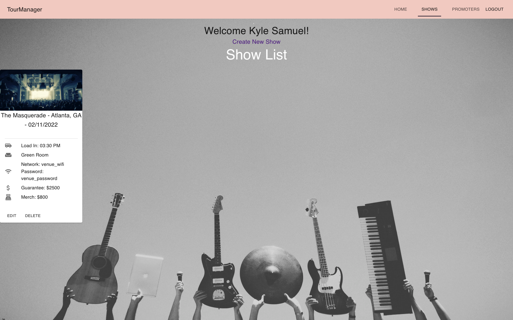

This project was bootstrapped with [Create React App](https://github.com/facebook/create-react-app), using the [Redux](https://redux.js.org/) and [Redux Toolkit](https://redux-toolkit.js.org/) template.

# TourManager

This repository is the React frontend for the TourManager single-page application. TourManager is designed to help tour managers log and organize their shows, giving them a quick overview of the day to come in a convenient, dynamic way. You may find the backend repository for TourManager [here](https://github.com/Ksamuel92/tourmanager-backend-react). You will need to clone both frontend and backend to use the application.

# Screenshots

## Prerequisites

Before you continue, make sure you meet the following requirements:

- Ruby 2.6.3 (for tourmanagerbackend)
- Rails 6.1.4 (for tourmanagerbackend)
- Node.js 16.11.1
- Npm 8.1.1

## Install

### Clone the repository

```bash
git clone git@github.com:Ksamuel92/tourmanager-frontend-react.git
cd tourmanager-frontend-react
```

### Install Dependencies

```bash
npm install
```

### How To Use TourManager

Once TourManager's [backend](https://github.com/Ksamuel92/tourmanager-backend-react) rails server is running, run npm start from the frontend's repository. The app will open www.localhost:3000 and you'll be taken to a landing page that looks like this. 

Click "Login" and create a new account with your full name, email, and password.

You can then click "Create New Show" and input details about a show, including the venue, guarantee, promoter and more!

Make as many shows as you need. The gross total of your merch and guarantees will be generated for ease. 

You can even check what promoter's are running each show so you can find their contact information easily.

When you log out, you can always get your shows back by using the same email that you logged in with the first time. 

## Contributing to TourManager

To contribute to TourManager, follow these steps:

- Fork this repository.
- Create a branch: git checkout -b <branch_name>.
- Make your changes and commit them: git commit -m '<commit_message>'
- Push to the original branch: git push origin tourmanager-frontend-react
- Create the pull request.
- Alternatively see the GitHub documentation on creating a pull request.

## Contact

If you would like to contact me, please email ksamuel92@gmail.com

## License

This project uses the following license: MIT License
